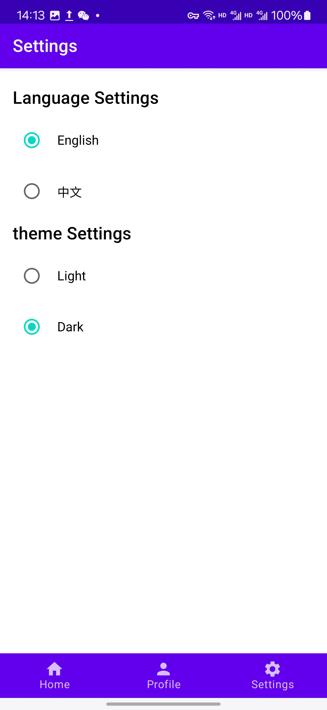

# Hello GitHub


## Project Overview

This is a GitHub client Android application built using Jetpack Compose, designed to provide a seamless GitHub browsing experience. Users can browse GitHub content without logging in, and after logging in, they can view their profile, repositories, submit issues, and more.

## Features Description

### 1. Home
- Users can browse and search popular open-source repositories on GitHub.
- Provides a search bar and filter options to filter by programming languages and repository stars.
- Each repository displays its name, description, and icon for easy access to relevant information.
- Clicking on the repository name opens the project details on GitHub in the browser.
- Clicking the "+" button on the right of each repository allows users to raise an issue.

  

  

### 2. Profile
- Displays the user's GitHub avatar, username, and repository list.
- Clicking on the repository name opens the project details on GitHub in the browser.
- Users can log out using the logout button in the top right corner.

  

### 3. Settings
- Allows users to switch the app language (e.g., English and Chinese).
- Supports theme switching (Light and Dark), allowing users to choose their preferred style.

  


## Tech Stack

- **Jetpack Compose 1.5.1**: For building the user interface.
- **Kotlin 1.9.10**: Main development language for the application.
- **Retrofit 2.9.0**: For handling network requests.
- **Lifecycle ViewModel Compose 2.6.2**: For managing UI state.
- **Jetpack Navigation**: For handling in-app navigation.

## Build and Run Guide

### Prerequisites

Ensure your development environment meets the following requirements:

- **Android Studio**: Latest stable version (Arctic Fox or above recommended).
- **JDK**: Version 11 or higher.
- **Android SDK**: API Level 29+.
- **Gradle**: 8.0 or above.
- **Kotlin**: 1.9.10 (compatible with Jetpack Compose).

### Clone the Repository

First, clone the project code from the GitHub repository:

```bash
git clone https://github.com/cyy854325486/hello-github.git
cd github-client-app
```

## Build the Project
- **Open Android Studio.**
- **Select Open an Existing Project and navigate to the cloned project directory.**
- **Sync the project: Click on File > Sync Project with Gradle Files.**
- **Build the project: Click on Build > Make Project or use the shortcut Ctrl + F9.**


## Run the Application
- **Connect your Android device or start an emulator.**
- **In Android Studio, select the target device.**
- **Click Run > Run 'app' or press the ▶️ run button in the toolbar.**

## Install APK
You can also manually install the APK via the command line:
- **Build the APK file:**
```bash
git clone https://github.com/yourusername/github-client-app.git
cd github-client-app
```
- **Install the APK to the device using adb:**
```bash
git clone https://github.com/yourusername/github-client-app.git
cd github-client-app
```

## Contact
If you encounter any issues or have suggestions for improvements, please submit an Issue on GitHub or contact the developer.
