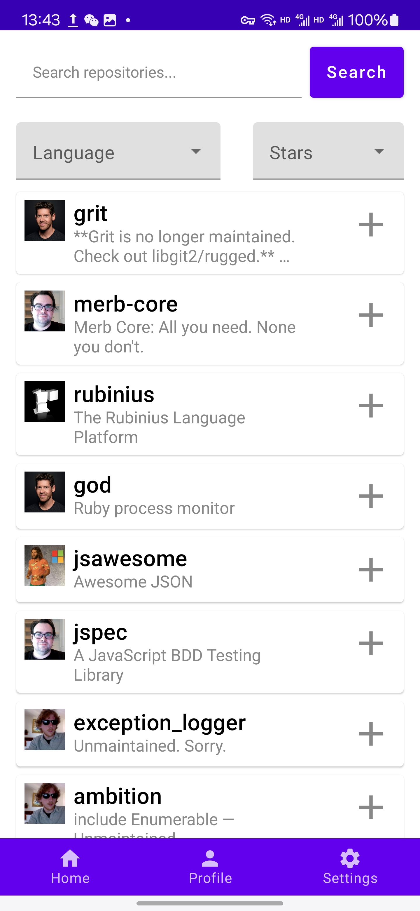
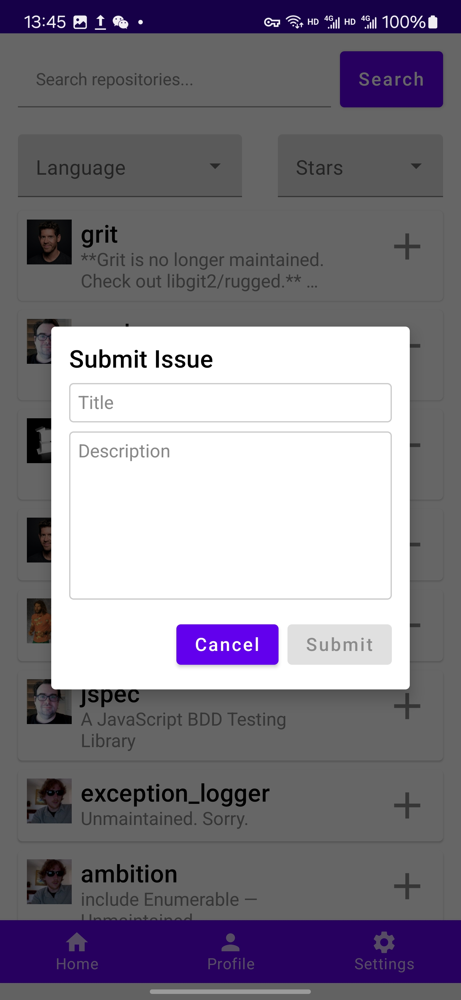
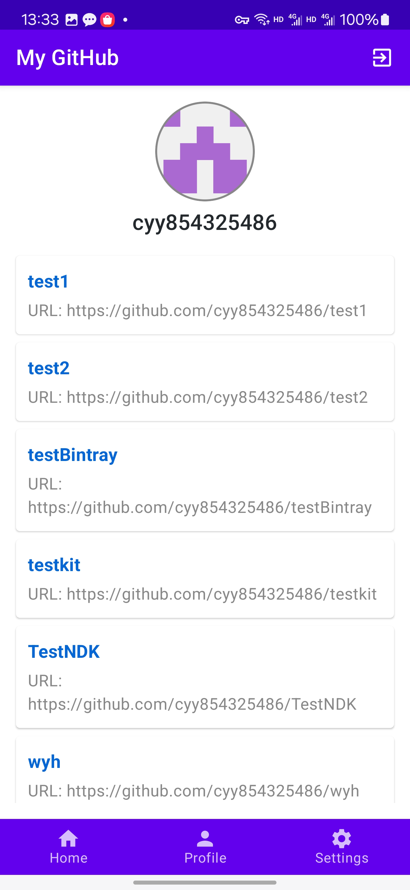
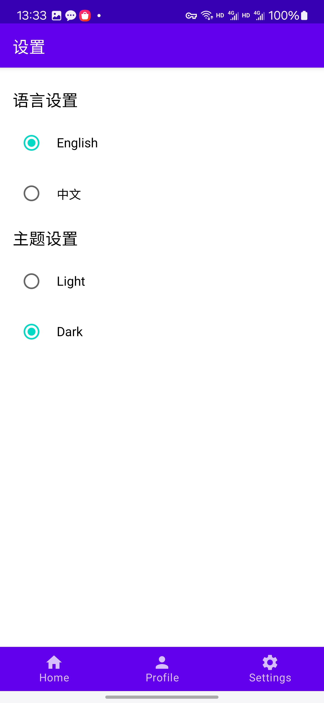

# GitHub Client Android Application


## 项目简介

这是一个使用 Jetpack Compose 构建的 GitHub 客户端 Android 应用程序，旨在提供无缝的 GitHub 浏览体验。用户可以在无需登录的情况下浏览 GitHub 内容，登录后可以查看自己的个人资料和仓库，提交 Issue 等。

## 功能描述

### 1. 首页 (Home)
- 用户可以浏览并搜索 GitHub 上的热门开源仓库。
- 提供搜索框和过滤选项，可以按编程语言和仓库星数进行筛选。
- 每个仓库显示其名称、描述及图标，方便用户了解相关信息。
- 点击仓库名称可以通过浏览器跳转到github项目详情。
- 点击每个仓库右边的“+”号可以发布Issue。

  

  

### 2. 个人资料 (Profile)
- 显示用户的 GitHub 头像、用户名及其仓库列表。
- 点击仓库名称可以通过浏览器跳转到github项目详情。
- 用户可以通过右上角的登出按钮退出登录。

  

### 3. 设置 (Settings)
- 允许用户切换应用语言（例如：英语和中文）。
- 支持切换主题模式（Light 和 Dark），用户可以选择喜欢的主题样式。

  


## 技术栈

- **Jetpack Compose 1.5.1**: 用于构建用户界面
- **Kotlin 1.9.10**: 应用程序主要开发语言
- **Retrofit 2.9.0**: 用于处理网络请求
- **Lifecycle ViewModel Compose 2.6.2**: 用于管理 UI 的状态
- **Jetpack Navigation**: 处理应用内的导航

## 构建和运行指南

### 先决条件

请确保你的开发环境满足以下条件：

- **Android Studio**: 最新稳定版本（建议使用 Arctic Fox 或以上）
- **JDK**: 11 或以上版本
- **Android SDK**: API Level 21+
- **Gradle**: 7.0 或以上版本
- **Kotlin**: 1.9.10（与 Jetpack Compose 兼容）

### 克隆仓库

首先，从 GitHub 仓库克隆项目代码：

```bash
git clone https://github.com/cyy854325486/hello-github.git
cd github-client-app
```

## 构建项目
- **打开 Android Studio。**
- **选择 Open an Existing Project，导航到克隆的项目目录。**
- **同步项目：点击 File > Sync Project with Gradle Files。**
- **构建项目：点击 Build > Make Project 或使用快捷键 Ctrl + F9。**


## 运行应用
- **连接你的 Android 设备或启动模拟器。**
- **在 Android Studio 中，选择目标设备。**
- **点击 Run > Run 'app' 或点击工具栏中的运行按钮 ▶️。**

## 安装APK
你也可以通过命令行手动安装 APK：
- **构建 APK 文件：**
```bash
git clone https://github.com/yourusername/github-client-app.git
cd github-client-app
```
- **使用 adb 安装 APK 到设备：**
```bash
git clone https://github.com/yourusername/github-client-app.git
cd github-client-app
```

## 联系方式
如果你在使用过程中遇到问题或有改进建议，请通过 GitHub 提交 Issue 或联系开发者。
